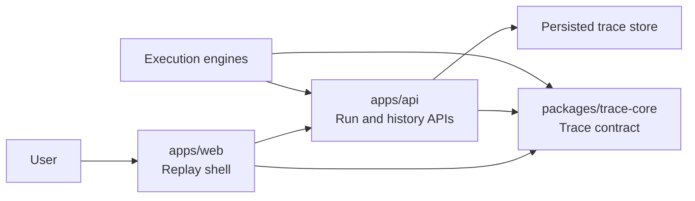
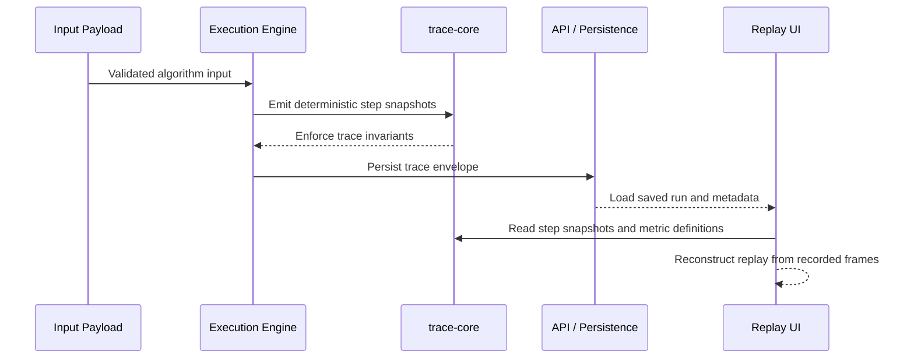
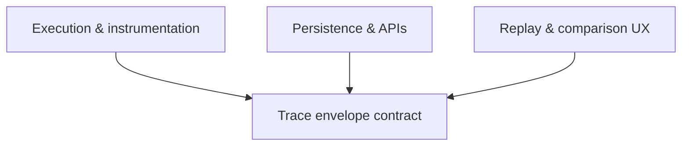
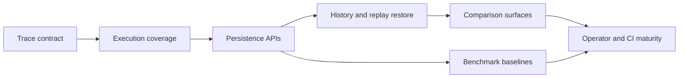

# TraceDeck Diagrams

## System Context

```mermaid
flowchart LR
  User[User] --> Web[apps/web<br/>Replay shell]
  Web --> API[apps/api<br/>Run and history APIs]
  API --> Store[Persisted trace store]
  Web --> Contract[packages/trace-core<br/>Trace contract]
  API --> Contract
  Engine[Execution engines] --> Contract
  Engine --> API
```

## Trace Lifecycle

```mermaid
sequenceDiagram
  participant Input as Input Payload
  participant Engine as Execution Engine
  participant Contract as trace-core
  participant API as API / Persistence
  participant UI as Replay UI

  Input->>Engine: Validated algorithm input
  Engine->>Contract: Emit deterministic step snapshots
  Contract-->>Engine: Enforce trace invariants
  Engine->>API: Persist trace envelope
  API-->>UI: Load saved run and metadata
  UI->>Contract: Read step snapshots and metric definitions
  UI-->>UI: Reconstruct replay from recorded frames
```

## Ownership Boundaries

```mermaid
flowchart TD
  Trace[Trace envelope contract]
  Execution[Execution & instrumentation]
  Persistence[Persistence & APIs]
  Experience[Replay & comparison UX]

  Execution --> Trace
  Persistence --> Trace
  Experience --> Trace
```

## Delivery Sequence

```mermaid
flowchart LR
  A[Trace contract] --> B[Execution coverage]
  B --> C[Persistence APIs]
  C --> D[History and replay restore]
  D --> E[Comparison surfaces]
  C --> F[Benchmark baselines]
  E --> G[Operator and CI maturity]
  F --> G
```
